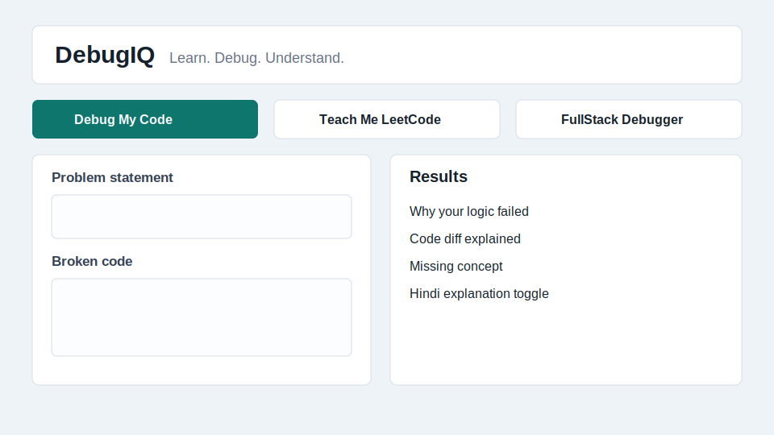
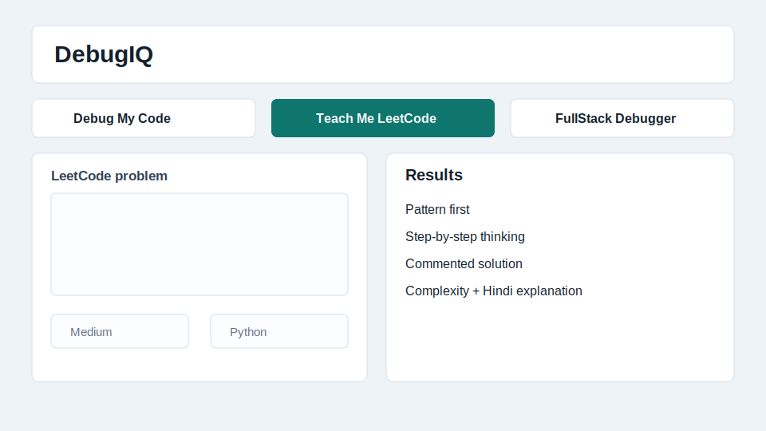
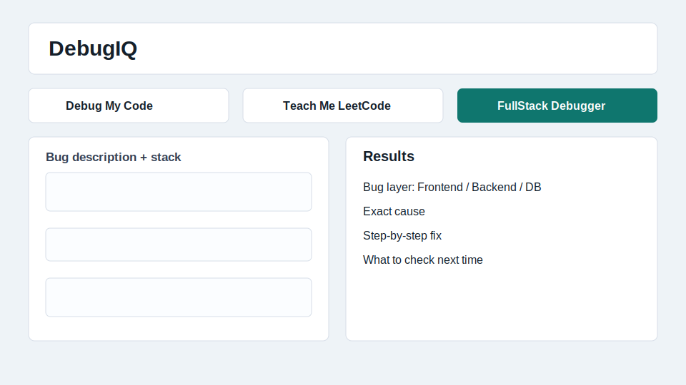
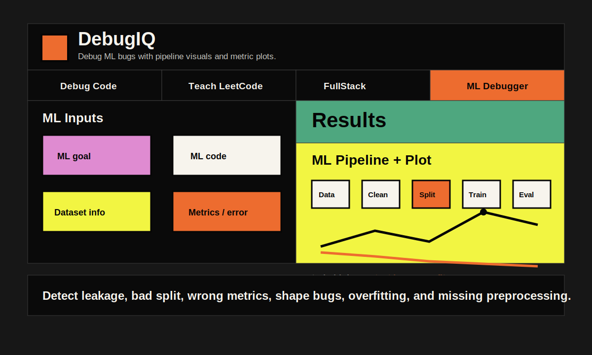

# DebugIQ

DebugIQ is an AI-powered debugging and learning web app for CS students. It helps users debug code, learn LeetCode approaches, diagnose full-stack bugs, and fix ML issues with corrected code, visual explanations, metric plots, and beginner-friendly English plus Hinglish explanations.


## Preview



## What It Solves

Beginners often know that their code is wrong, but they do not understand why it failed. DebugIQ focuses on learning, not just answers. It explains the bug, the missing concept, the corrected code, and the thinking process in a way that is easy to follow.

The app is built especially for Indian CS students, with explanations available in simple English and Hinglish.

## Features

- Four modes: code debugging, LeetCode teaching, full-stack debugging, and ML debugging.
- Corrected code output when code is provided.
- Visual explanations with array boxes, pointer/finger movement, request flow maps, recursion stack visuals, ML pipelines, and metric plots.
- Auto-detect support for LeetCode difficulty and programming language.
- Hinglish explanation toggle using Roman script.
- Twilio OTP authentication.
- Gemini-powered analysis through the Google Generative AI SDK.
- Render-ready Flask deployment setup.

## Modes

### 1. Debug My Code

Use this when you have a broken solution and want to understand why the logic failed.

Inputs:
- Problem statement
- Broken code
- Working code, optional

Outputs:
- Why the logic failed
- Code diff explanation if working code is provided
- Missing CS concept
- Corrected code or fix direction
- Visual dry run with arrays, pointers, indexes, or flow diagrams
- English and Hinglish explanations


### 2. Teach Me LeetCode

Use this when you want to learn how to approach a coding problem before jumping into code.

Inputs:
- Problem statement
- Difficulty: Easy, Medium, Hard, or Auto Detect
- Language: Python, Java, C++, JavaScript, or Auto Detect

Outputs:
- Algorithmic pattern
- Step-by-step thinking approach
- Clean commented solution
- Line-by-line explanation
- Time and space complexity
- Visual dry run
- Hinglish explanation



### 3. FullStack Debugger

Use this when your app is failing across frontend, backend, database, or API connection layers.

Inputs:
- Bug description
- Tech stack
- Frontend code or error, optional
- Backend code or error, optional
- Database query or error, optional

Outputs:
- Bug layer: frontend, backend, database, or connection
- Exact cause
- Step-by-step fix
- What to check next time
- Visual request-flow map
- English and Hinglish explanations



### 4. ML Debugger

Use this when your ML model has bad accuracy, overfitting, leakage, shape errors, preprocessing mistakes, or confusing predictions.

Inputs:
- ML goal
- ML code
- Dataset info
- Error, metrics, or weird behavior
- Expected behavior, optional

Outputs:
- What the ML code is doing
- Runtime and logical ML mistakes
- Corrected ML code
- Data leakage and preprocessing checks
- Train/test split and metric analysis
- ML pipeline visual
- Accuracy/loss metric plot when values are provided
- Hinglish explanation



## Why DebugIQ Is Different

| Feature | Generic Chatbot | DebugIQ |
|---|---:|---:|
| Takes problem statement with broken code | Partial | Yes |
| Teaches approach before code | Not always | Yes |
| Explains why logic failed | Partial | Yes |
| Gives visual dry runs | Not structured | Yes |
| Identifies full-stack bug layer | Not structured | Yes |
| Debugs ML logic and metrics | Partial | Yes |
| Hinglish explanation | Not focused | Yes |
| Built for Indian CS students | No | Yes |

## Tech Stack

- Frontend: HTML, CSS, JavaScript
- Backend: Flask
- AI: Google Gemini through `google-generativeai`
- Authentication: Twilio Verify OTP
- Deployment: Render

## Project Structure

```text
.
├── app.py
├── requirements.txt
├── render.yaml
├── README.md
├── templates/
│   ├── index.html
│   ├── login.html
│   └── verify.html
├── static/
│   ├── css/styles.css
│   ├── js/app.js
│   └── img/debugiq-logo.svg
└── docs/
    └── screenshots/
```

## Environment Variables

Create a `.env` file in the project root:

```text
GEMINI_API_KEY=your_gemini_api_key
GEMINI_MODEL=gemini-1.5-flash
SECRET_KEY=replace-with-a-long-random-secret
TWILIO_ACCOUNT_SID=your_twilio_account_sid
TWILIO_AUTH_TOKEN=your_twilio_auth_token
TWILIO_VERIFY_SERVICE_SID=your_twilio_verify_service_sid
```

Do not commit `.env`. The repository includes `.env.example` for reference.

## Run Locally

```bash
python3 -m venv .venv
.venv/bin/python -m pip install -r requirements.txt
.venv/bin/python app.py
```

Open:

```text
http://127.0.0.1:8000
```

## Deploy on Render

1. Push this repository to GitHub.
2. Create a new Render Web Service.
3. Use this build command:

```bash
pip install -r requirements.txt
```

4. Use this start command:

```bash
gunicorn app:app
```

5. Add the environment variables from `.env.example` in Render.
6. Deploy the service.

## Live Demo

Render URL: `Add your Render live URL here`

## Security Notes

- API keys are loaded from environment variables.
- `.env` is ignored by Git.
- Twilio OTP protects the app before users can access the analysis page.

## Resume Bullet

Built DebugIQ, a Flask web app with 4 modes: code debugger, LeetCode approach teacher, full-stack bug diagnoser, and ML debugger, powered by Gemini with English and Hinglish explanations, corrected code, visual dry runs, ML metric plots, and Twilio OTP authentication.
